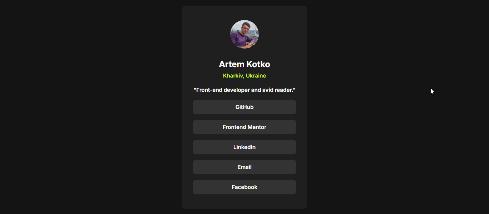

# Frontend Mentor - Social links profile solution

This is a solution to the [Social links profile challenge on Frontend Mentor](https://www.frontendmentor.io/challenges/social-links-profile-UG32l9m6dQ). Frontend Mentor challenges help you improve your coding skills by building realistic projects.

## Table of contents

- [Overview](#overview)
  - [The challenge](#the-challenge)
  - [Screenshot](#screenshot)
  - [Links](#links)
- [My process](#my-process)
  - [Built with](#built-with)
  - [What I learned](#what-i-learned)
  - [Continued development](#continued-development)
  - [Useful resources](#useful-resources)

## Overview

In this small project, I built out my social link-sharing profile.

### The challenge

Users should be able to:

- See hover and focus states for all interactive elements on the page

### Screenshot



### Links

- Solution URL: (https://artemkotko14.github.io/social_links_profile/)

## My process

### Built with

- Semantic HTML5 markup
- CSS custom properties
- Flexbox

### What I learned

In this task I was required to build my social links profile.

During this challenge I could practice once again the use of flexbox, hover and focus states and use of custom properties.

The most difficult challenge for me in this project was to make links from buttons to respective pages.
I managed to do that with onclick Event:

```html
<button onclick="location.href='https://github.com/artemkotko14'" type="button">
  GitHub
</button>
```

### Continued development

I would like to work more with focus states to make my pages even more interactive for users.

### Useful resources

- [onclick](https://www.w3schools.com/jsref/event_onclick.asp) - Read about onclick Event.
